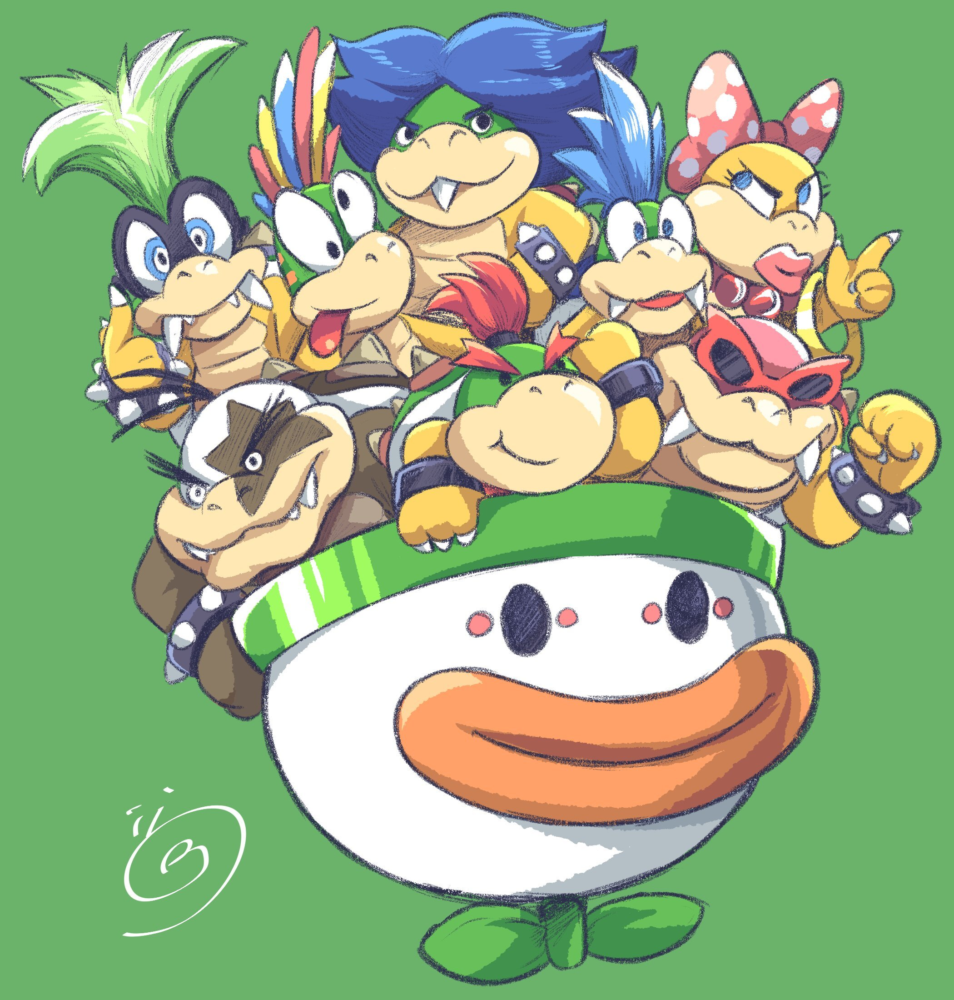

Welcome to the Ultimate Bowser Jr. / Koopaling Guide!
=====================================================

Contents:
--------

.. toctree::
   :maxdepth: 2

   glossary
   fundamentals

This guide was originally made by `Fumble <https://twitter.com/FunbleJr/>`_ and adapted into a proper Sphinx documentation by `PotatoCouch <https://twitter.com/the_potatocouch/>`_

The goal for the document is to be an accessible resource for Bowser Jr players looking to improve.  

Here you will find instructions for fundamental Smash skills, Jr's bread and butter combos, set ups and advanced techniques. It is not neccessary to learn every single last piece of tech in this sheet, but the more effort you put in the more Jr will reward you.  

If you are new to Competitive Smash in general, we highly suggest you start with the Fundamentals sheet.  

Inspired by Jukeboxer (creator of Link's Road to Mastery)  

.. note::
   Art by `TheSmashToons <https://twitter.com/TheSmashToons/>`_

